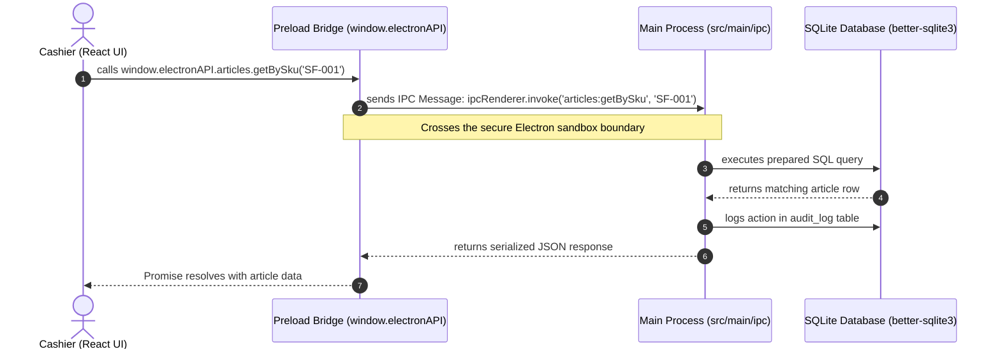
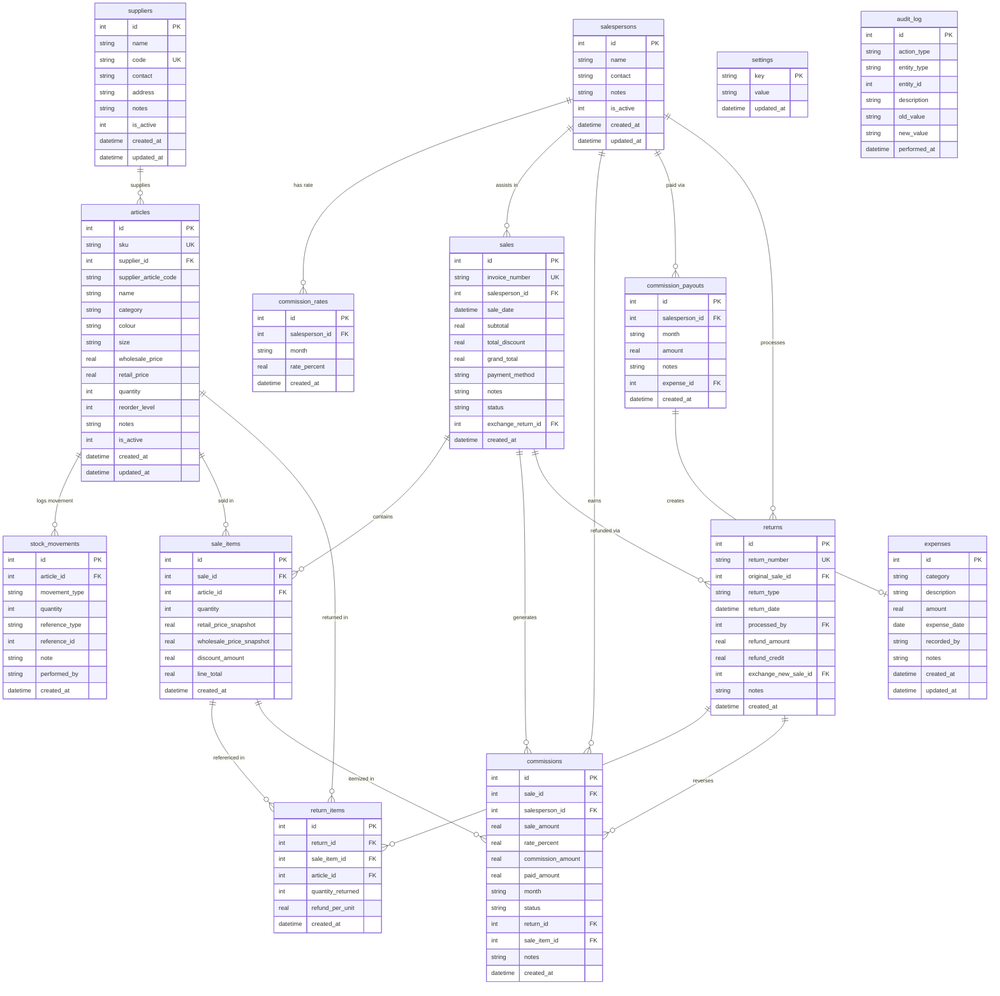

# Soni Fashion POS — System Architecture & Codebase Documentation

> **Target Audience:** Full-Stack Developers (React, Node.js, Next.js) transitioning to Electron & SQLite.  
> **Application Type:** Offline-First Windows Desktop Point-of-Sale (POS) System.  
> **Tech Stack:** Electron, React 19, Vite, Tailwind CSS, Zustand, React Router v7, Better-SQLite3.

---

## 1. Executive Summary & Full-Stack Analogy

In a traditional web application (e.g., built with Next.js or React + Node.js/Express):
* Your **Frontend (React)** runs in the customer's web browser (Chrome, Safari, Edge).
* Your **Backend (Node.js API)** runs on a remote server (AWS, Vercel, Railway).
* They communicate over a network via HTTP/REST or WebSockets.

**Soni Fashion POS** is built with **Electron**, which bundles **both the browser and the backend server into a single offline desktop application**:
* **Chromium** is embedded to render the UI (React Single Page Application).
* **Node.js** is embedded to run backend logic (filesystem access, SQLite database, thermal printer interaction).

To protect user security and prevent malicious scripts from wiping system drives, Electron strictly isolates these two environments.

---

## 2. The Three Pillars of the Codebase

The application is structured into three distinct domains inside the `src/` directory:

```text
src/
├── main/       <-- 🧠 The Main Process (Node.js Backend & SQLite)
├── preload/    <-- 🌉 The Preload Bridge (Secure IPC Middleware / SDK)
└── renderer/   <-- 🎨 The Renderer Process (React + Vite + Tailwind UI)
```

### 🧠 A. `src/main/` — The Main Process (Node.js Backend)
* **Role:** Serves as the backend server.
* **Responsibilities:**
  * Manages application lifecycle and native desktop windows (`index.js`).
  * Connects to and executes queries against the local **SQLite database** (`src/main/db/`).
  * Handles Inter-Process Communication (IPC) requests coming from the frontend (`src/main/ipc/`).
  * Communicates with OS hardware (printers, file systems, backup drives).

### 🎨 B. `src/renderer/` — The Renderer Process (React Frontend)
* **Role:** Serves as the client-side UI.
* **Responsibilities:**
  * A standard React Single Page Application (SPA) styled with Tailwind CSS and managed with Zustand.
  * Renders interactive POS screens, inventory tables, and reports.
  * **Sandbox Constraint:** Runs with `contextIsolation: true`. It **cannot** directly import Node.js modules (`fs`, `path`, `better-sqlite3`) or access the operating system.

### 🌉 C. `src/preload/` — The Preload Bridge (API Gateway)
* **Role:** The secure middleware connecting React to Node.js.
* **Responsibilities:**
  * Uses Electron's `contextBridge` to expose a controlled dictionary of async functions to the frontend via `window.electronAPI`.
  * Translates React function calls into IPC messages across the sandbox boundary.

---

## 3. High-Level Data Flow

When a cashier interacts with the UI (e.g., searching for a clothing SKU), data flows through a 3-step IPC bridge:



---

## 4. SQLite Database Architecture

### A. How SQLite Works in Electron (`better-sqlite3`)
Unlike web databases (PostgreSQL/MySQL) accessed over a network via async ORMs (Prisma/Drizzle), Soni Fashion POS uses **SQLite via `better-sqlite3`**:
* **Single File Storage:** The entire database is stored locally as `sonifashion.db` inside the OS user data directory (`app.getPath('userData')`, e.g., `%APPDATA%/soni-fashion-pos` on Windows).
* **Synchronous & Zero Latency:** Queries run in-process directly against the disk. Because there is no network overhead, complex joins execute in fractions of a millisecond.
* **Runtime PRAGMAs:** Enabled on startup in `src/main/db/database.js`:
  * `journal_mode = WAL` (Write-Ahead Logging for crash resilience and concurrency).
  * `foreign_keys = ON` (Mandatory enforcement of relational integrity; disabled by default in SQLite).

---

### B. Comprehensive Relational Schema (All 14 Tables)

The database consists of **14 relational tables** grouped into four functional domains:



---

### C. Domain Module Breakdown & Retail Scenarios

#### 1. Inventory & Catalog Domain
* **`suppliers`**: Stores vendor details and unique codes (e.g., `AK` for Al-Karam).
* **`articles`**: Represents physical clothing items.
  * **`reorder_level` Scenario:** A Red Velvet Bridal Kurta has `reorder_level = 5`. When stock drops from 20 down to 5, the dashboard alerts the owner to reorder.
* **`stock_movements`**: An immutable audit ledger.
  * **Scenario:** Why did stock change from 20 to 18? Instead of just updating a number, the system inserts an immutable row: `movement_type = 'OUT'`, `quantity = -2`, `reference_type = 'sale'`, `reference_id = 101`. Handles `IN` (shipments), `OUT` (sales), `RETURN_IN` (refunds), and `ADJUSTMENT` (damage/audits).

#### 2. POS & Transactions Domain (1-to-Many Pattern)
* **`sales` (Receipt Header):** Stored once per checkout. Holds `invoice_number` (`SF-INV-001`), date, cashier ID, payment method, and grand total.
* **`sale_items` (Line Items):** Stored multiple times per invoice (one row per product sold).
  * **Price Snapshotting:** Stores `retail_price_snapshot`. If an item's price increases next month from $100 to $150, past receipts must still reflect the historical $100 price!
* **`returns` & `return_items`**: Mirrors the sales structure for refunds and exchanges (`SF-RET-001`), linking directly back to the original `sale_id`.

#### 3. Staff & Commissions Domain
* **`salespersons`**: Store staff members.
* **`commission_rates`**: Monthly percentage rate earned by a salesperson.
* **`commissions`**: Itemized ledger tracking commission earned on every sale item and reversed on every return item.
* **`commission_payouts`**: Records monthly salary/commission disbursements and automatically creates a linked record in `expenses`.

#### 4. System & Accounting Domain
* **`expenses`**: Shop overheads (utility bills, tea/refreshments, staff payouts).
* **`settings`**: Key-value configuration store (`schema_version`, shop branding, prefixes).
* **`audit_log`**: Security trail recording system actions (who created/updated/deleted records).

---

## 5. Offline Migration Engine (`src/main/db/migrations.js`)

In web development, migration scripts are executed via CLI tools during deployment (`npx prisma migrate`). In offline desktop software, **the application must self-migrate its database on startup** when released to customer PCs.

### A. How Migrations Work
1. **Bootstrap Check:** Creates the `settings` table if it does not exist.
2. **Version Tracking:** Reads `schema_version` from `settings` (returns `0` on a fresh install).
3. **Sequential Execution:** Wraps migration logic in conditional checks (`if (currentVersion < X)`). If the database is already at version 8, all migration blocks are skipped, preserving existing customer data.
4. **Atomic Transactions:** Each migration runs inside `db.transaction(...)`. If an error occurs, SQLite rolls back the entire version change to prevent partial schema corruption.

### B. Summary of Migrations (V1 to V8)
* **V1:** Creates initial 12 tables and performance indexes; sets version to 2.
* **V2 (SQLite Table Rebuild Pattern):** SQLite does not support modifying `CHECK` constraints via `ALTER TABLE`. To relax the `payment_method` constraint on `sales`, V2 creates `sales_v2`, copies all existing rows over (`INSERT INTO sales_v2 SELECT * FROM sales`), drops `sales`, and renames `sales_v2` to `sales`.
* **V3:** Sets default staff commission rate to 1% and populates existing staff records.
* **V4:** Adds `commission_payouts` table and uses `ALTER TABLE commissions ADD COLUMN paid_amount` to safely add columns without data loss.
* **V5:** Adds `expense_id` foreign key to `commission_payouts`.
* **V6:** Adds `return_id`, `sale_item_id`, and `notes` to `commissions` for itemized reversal ledgers.
* **V7 & V8:** Seeds and enforces official invoice/return prefixes (`SF-INV`, `SF-RET`).

---

## 6. Hardware Integration & Printing Engine (`src/main/ipc/print.ipc.js`)

### A. Silent Thermal Receipt Printing
To print thermal receipts without showing system print dialogs:
1. Electron creates a hidden off-screen browser window (`new BrowserWindow({ show: false, width: 320, height: 800 })`).
2. It loads `src/main/receipt/receipt.html` and injects enriched receipt JSON data (combining transaction details with shop branding from SQLite `settings`).
3. Executes `receiptWindow.webContents.print({ silent: true, deviceName: configuredPrinter })` to send raw data directly to the ESC/POS thermal printer.

### B. Image Optimization & In-Memory Caching
* **Monochrome 1-Bit Thresholding (`receipt.html`):** Thermal printers print in 1-bit monochrome (pure black or white). Sending color or grayscale PNGs results in muddy halftoning. Before printing, the HTML5 Canvas applies a luminance filter:
  ```javascript
  const brightness = 0.299 * r + 0.587 * g + 0.114 * b;
  const value = brightness > 160 ? 255 : 0; // Pure white or pure black
  ```
* **Node.js Disk Cache:** `print.ipc.js` caches `logo.png` in RAM (`cachedLogoDataUrl`) after the first read, avoiding repetitive disk I/O.
* **Chromium Monochrome Cache:** `receipt.html` caches the thresholded canvas data URL (`cachedMonochromeLogoUrl`), skipping pixel manipulation loops on subsequent print jobs during the session.

---

## 7. Automated Backup Service (`src/main/services/backup.service.js`)

To protect against hardware failure or accidental data loss without requiring cloud servers:
* **Hourly Scheduled Backups:** A background timer (`setInterval`) copies `sonifashion.db` to an archive folder every 60 minutes while the app runs.
* **Shutdown Backups:** When the app closes, it creates a timestamped daily backup (`sonifashion_YYYY-MM-DD.db`) and updates `sonifashion_latest.db`.
* **Automatic Secondary Drive Detection:** The service checks if drive `D:` is available (`isWindowsDriveAvailable('D')`). If present, it automatically mirrors backups to `D:\SoniFashionPOS\backups` to protect against Windows `C:` drive crashes or OS reinstalls.
* **OS-Level Security Protection:** To prevent cashiers from accidentally deleting or corrupting backup archives, administrators can apply Windows NTFS Permissions (Deny Delete ACLs) or mark the backup directory as a Super Hidden System Folder (`attrib +h +s "D:\SoniFashionPOS"` in Windows CMD).

---

## 8. Frontend UI & State Management (`src/renderer`)

### A. Why `<HashRouter>` is Mandatory in Electron
In web applications, `<BrowserRouter>` uses clean paths (`/inventory`). When a browser requests `/inventory`, the web server (Next.js/Nginx) serves `index.html`.
In production Electron apps, files are loaded locally via `file://` URLs (`file:///C:/Program%20Files/.../index.html`). If you use `<BrowserRouter>` and navigate to `/inventory`, the OS looks for a folder named `/inventory` on the hard drive and throws a **404 Not Found error**. `<HashRouter>` (`/#/inventory`) keeps navigation state safely inside the client URL fragment.

### B. POS Checkout State (`useCartStore.js`)
State is managed using **Zustand** for zero-boilerplate, high-performance UI updates during fast-paced checkout workflows:
* **Real-Time Stock Blocking:** When `addItem()` or `updateQuantity()` is called, the store checks `item.max_stock`. If a cashier attempts to add a quantity exceeding available storeroom inventory, it immediately throws an error and blocks the addition.
* **Dynamic Discount Calculations:** Encapsulates business logic for per-item discounts and order-wide discounts, computing real-time line subtotals and grand totals on the fly without triggering unnecessary component re-renders.

---

## 9. Codebase Quick-Reference Directory

| Module / File | Description & Purpose |
| :--- | :--- |
| `src/main/index.js` | Main process entry point; initializes window, database, IPC, and backup scheduler. |
| `src/main/db/database.js` | Initializes Better-SQLite3, enables WAL/Foreign Keys, runs migrations/seeder. |
| `src/main/db/migrations.js` | Offline version-tracked database migration engine (V1 to V8). |
| `src/main/db/seed.js` | Seeds initial shop settings and branding into SQLite on first run. |
| `src/main/ipc/*.ipc.js` | Domain-specific IPC handlers (articles, sales, returns, reports, print, suppliers). |
| `src/main/services/backup.service.js` | Automated hourly and shutdown database backup engine with D: drive mirroring. |
| `src/main/receipt/receipt.html` | Off-screen HTML thermal receipt template with 1-bit monochrome canvas filter. |
| `src/preload/index.js` | Preload script exposing secure `window.electronAPI` bridge via `contextBridge`. |
| `src/renderer/src/App.jsx` | Root React component configuring `<HashRouter>` and layout routes. |
| `src/renderer/src/store/cartStore.js` | Zustand store powering POS checkout cart, discounts, and real-time stock checks. |
| `src/renderer/src/pages/*.jsx` | UI pages (Sale, Inventory, Returns, Reports, Suppliers, Salespersons, Settings). |
